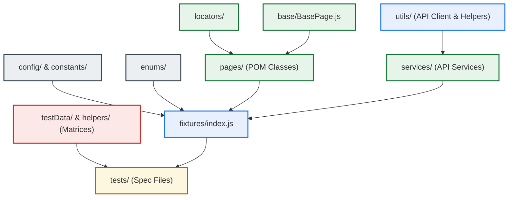

# Playwright Enterprise Automation Framework

An enterprise-grade, highly scalable, and modular test automation framework built on Playwright using JavaScript (CommonJS). This repository implements industrial-standard clean code principles, strict Page Object Model (POM) separation, locator isolation, dynamic API services, environment-based configuration loading, and robust assertion layers.

---

## 1. Architecture Overview

### Framework Architecture
This framework is built upon a layered architecture designed to decouple configuration, data, user actions, and test assertions. By separating these concerns, tests remain readable, declarative, and highly resilient to UI or API changes.



### Design Patterns Used
* **Page Object Model (POM)**: Every web page has a corresponding Page class in the [pages/](file:///c:/Users/satish.patil1/Sp-learning/all-in--main/pages) directory that encapsulates page actions, workflows, and elements, keeping the tests clean of raw locator queries and action chains.
* **Locator Isolation (Locator Factory Pattern)**: Selectors are strictly isolated in the [locators/](file:///c:/Users/satish.patil1/Sp-learning/all-in--main/locators) folder and separated from page action logic. This prevents locator duplication and guarantees that UI changes only require updates in a single locator file.
* **Dependency Injection (Playwright Fixtures)**: Page and service instances are registered in the [fixtures/index.js](file:///c:/Users/satish.patil1/Sp-learning/all-in--main/fixtures/index.js) file and automatically injected into spec files as arguments. This eliminates manual instantiation boilerplate (`new Page()`) in test blocks.
* **Facade Pattern (Service Layer)**: API tests route operations through dedicated classes in the [services/](file:///c:/Users/satish.patil1/Sp-learning/all-in--main/services) directory that map relative endpoints, shielding test specs from URL concatenation and headers setup.
* **Strategy Pattern (Environment Selector)**: System properties are dynamically mapped using environment profiles (`qa`, `dev`, `prod`), loading the active credentials based on runtime environment variables.

### Folder Structure
The workspace is organized into a highly structured folder hierarchy:
* `base/`: Base classes wrapping Playwright engine operations.
* `config/`: System config loaders and environment profiles.
* `constants/`: Global configurations, URLs, timeouts, and messages.
* `enums/`: Immutable status codes and test expectations.
* `fixtures/`: Test fixture definitions for dependency injection.
* `helpers/`: Shared business workflows and data-driven matrix generators.
* `locators/`: Centralized UI selectors separated by page.
* `pages/`: Page Object classes encapsulating page actions.
* `services/`: API endpoint facade classes.
* `testData/`: Static test data models, validation values, and boundary lists.
* `tests/`: Test spec suites organized by scope and capability.
* `upload/`: Static test assets (e.g. upload images).
* `utils/`: Low-level framework libraries (API client, loggers, custom assertion wrappers).

### Scalability Approach
* **Universal API Client**: Implemented a generic [apiClient.js](file:///c:/Users/satish.patil1/Sp-learning/all-in--main/utils/apiClient.js) that handles headers, cookies, token injection, and performance measurements dynamically. Adding new endpoints requires zero modifications to the core request handlers.
* **Assertion Abstraction**: Standardized assertions into [assertionUtils.js](file:///c:/Users/satish.patil1/Sp-learning/all-in--main/utils/assertionUtils.js) (UI validations) and [responseValidation.js](file:///c:/Users/satish.patil1/Sp-learning/all-in--main/utils/responseValidation.js) (API responses), ensuring tests are strictly declarative.
* **Data Matrix Generation**: Leveraged field matrix helpers (such as [booking.field.matrix.js](file:///c:/Users/satish.patil1/Sp-learning/all-in--main/helpers/booking.field.matrix.js)) to programmatically generate and run hundreds of boundary value checks without writing hundreds of manual tests.

---

## 2. Project Flow & Runtime Flow

### Complete Execution Flow Step-by-Step
1. **Runner Initialization**: The Playwright runner parses [playwright.config.js](file:///c:/Users/satish.patil1/Sp-learning/all-in--main/playwright.config.js) and scans target spec files inside the [tests/](file:///c:/Users/satish.patil1/Sp-learning/all-in--main/tests) directory.
2. **Environment Mapping**: Config imports [config/index.js](file:///c:/Users/satish.patil1/Sp-learning/all-in--main/config/index.js), resolving the active environment profile (defaults to `qa`) via `TEST_ENV` and loading credentials.
3. **Fixture Resolution**: Prior to running a test block, Playwright resolves requested fixtures (e.g. `swagLabsLoginPage` or `bookingService`) from [fixtures/index.js](file:///c:/Users/satish.patil1/Sp-learning/all-in--main/fixtures/index.js).
4. **Context Construction**:
   - For UI tests: Playwright opens a clean browser context and navigates to the page using locator strings defined in the [locators/](file:///c:/Users/satish.patil1/Sp-learning/all-in--main/locators) directory.
   - For API tests: Playwright injects the `apiClient` fixture.
5. **Action Flow**: The spec file calls methods on the injected fixture. The methods execute wait conditions and operations defined in the `pages/` or `services/` layers.
6. **Logging & Verification**: Every step prints console updates via [logUtils.js](file:///c:/Users/satish.patil1/Sp-learning/all-in--main/utils/logUtils.js) and triggers assertions from the validation helpers.

### Interaction Model
The diagram below illustrates how tests interact with pages, services, helpers, and utilities:

```
[ Test Spec File ] ──► Consumes Fixtures (fixtures/index.js)
       │
       ├──► (UI Flow) ──► POM Page Object (pages/) ──► Base Action (base/BasePage.js) ──► Locators (locators/)
       │                                                      │
       │                                                      └──► Log / Assertion Utils
       │
       └──► (API Flow) ─► Service Facade (services/) ──► API Client (utils/apiClient.js)
                                                              │
                                                              └──► Response Validation (utils/responseValidation.js)
```

---

## 3. Quick Start

### Prerequisites
- [Node.js](https://nodejs.org/) (v18.0.0 or higher recommended)
- npm (v9.0.0 or higher recommended)

### Installation
1. Clone the repository to your local machine.
2. Navigate to the project root directory.

### Dependency Setup
Install all framework dependencies:
```bash
npm install
```

### Playwright Setup & Browser Installation
Install the required browser binaries needed to run UI automation tests:
```bash
npx playwright install
```
*(Or specify a single browser for local execution: `npx playwright install chromium`)*

### Execution Commands
You can execute tests using the following commands:

| Command | Action |
|---|---|
| `npx playwright test` | Executes all tests across all configured projects in parallel |
| `npx playwright test tests/REST-API` | Runs only the REST API test suites |
| `npx playwright test tests/test-table-playwright` | Runs only the tabular sorting and filtering test suites |
| `npx playwright test --project=chromium` | Runs all tests using the Chromium browser project |
| `npx playwright test --headed` | Executes tests in headed mode (visible browser windows) |
| `npx playwright test --debug` | Opens the Playwright Inspector for step-by-step debugging |
| `npx playwright test --grep @smoke` | Runs only tests matching the `@smoke` tag |

### Report Commands
After running tests, you can generate and open the HTML report:
```bash
npx playwright show-report
```

---

## 4. Environment Configuration

### `.env` Usage
The framework utilizes environment variables to drive execution urls and credentials. You can set these variables directly in your terminal, configuration file, or system environment.

### Environment-Based Execution
You can switch execution environments by setting the `TEST_ENV` variable to `qa`, `dev`, or `prod`:

* **PowerShell**:
  ```powershell
  $env:TEST_ENV="dev"; npx playwright test tests/REST-API --project=chromium
  ```
* **Git Bash / Linux**:
  ```bash
  TEST_ENV=prod npx playwright test tests/REST-API --project=chromium
  ```

### Configuration & Secrets Handling
Sensitive credentials are not checked into source control. They are retrieved at runtime via `process.env`. If a variable is missing, the framework falls back to configured defaults for the active profile inside [config/env.js](file:///c:/Users/satish.patil1/Sp-learning/all-in--main/config/env.js). In CI/CD pipelines, these values are mapped as environment secrets.

---

## 5. Enterprise Best Practices Applied

* **Strict POM Standards**: No UI selector logic or wait loops are written inside test spec files. Specs only contain test assertions and semantic method calls.
* **Reusable Architecture**: Global interactions are wrapped within [BasePage.js](file:///c:/Users/satish.patil1/Sp-learning/all-in--main/base/BasePage.js). Common API utilities (token management, response time checks) are abstracted within [apiClient.js](file:///c:/Users/satish.patil1/Sp-learning/all-in--main/utils/apiClient.js).
* **Maintainability**: Low-coupling; locators are isolated from page scripts, ensuring selector changes do not break page logic.
* **Scalability**: Capable of executing hundreds of test scenarios in parallel across multiple target environments.
* **Reporting**: Injects detailed console logs and supports HTML reports, with automatic trace file compilation and failure snapshots.
* **Logging**: Utilizes [logUtils.js](file:///c:/Users/satish.patil1/Sp-learning/all-in--main/utils/logUtils.js) to format and output timestamps, log levels (`INFO`, `WARN`, `ERROR`), and process state descriptions.
* **CI/CD Readiness**: Playwright config features built-in environment variable selectors (`process.env.CI`), limiting workers to `1` (or desired parallel counts) in CI environment, disabling headed browsers, capturing traces on retry, and writing screenshots on failure.
* **Parallel Execution**: Enabled fully parallel test executions (`fullyParallel: true`) globally.
* **Retry Handling**: Automatically configured retries on failure when executed inside CI pipelines (`retries: process.env.CI ? 2 : 0`).
* **Coding Standards**: Standardized JavaScript CommonJS module patterns (`require`/`module.exports`), strict uppercase constants, clean CamelCase naming, JSDoc comment blocks.

---

## 6. Folder-by-Folder Output Explanation

Here is a detailed breakdown of every folder in the repository, explaining its purpose, outputs, responsibility, and how it contributes to the framework:

### [base](file:///c:/Users/satish.patil1/Sp-learning/all-in--main/base)
* **Purpose**: Houses base classes for the Page Object Model.
* **Outputs**: `BasePage` class containing standardized actions (`click`, `fill`, `navigate`, `waitFor`).
* **Responsibility**: Wraps Playwright's base interactions, providing automated wait-for-element thresholds.
* **Contribution**: Prevents flaky test steps by enforcing explicit waits before elements are interacted with.

### [config](file:///c:/Users/satish.patil1/Sp-learning/all-in--main/config)
* **Purpose**: Compiles active configuration profiles.
* **Outputs**: Resolved URL endpoints, system timeouts, and credentials based on the selected environment.
* **Responsibility**: Dynamically loads configuration profiles from environment variables (`TEST_ENV`).
* **Contribution**: decouples environmental settings from the test scripts, facilitating seamless switching between QA, Dev, and Prod.

### [constants](file:///c:/Users/satish.patil1/Sp-learning/all-in--main/constants)
* **Purpose**: Serves as a single repository for immutable configuration properties.
* **Outputs**: Configuration objects for URLs, timeouts, and standard validation messages.
* **Responsibility**: Houses constants to prevent string and timing duplication.
* **Contribution**: Eliminates "magic numbers" and hardcoded values across the codebase.

### [enums](file:///c:/Users/satish.patil1/Sp-learning/all-in--main/enums)
* **Purpose**: Declares structured read-only key-value maps.
* **Outputs**: Standardized status codes (`HTTP_STATUS`) and login expectations (`LOGIN_EXPECTATION`).
* **Responsibility**: Manages strictly typed mappings to prevent typing errors.
* **Contribution**: Simplifies maintenance of status code checks and flow decisions.

### [fixtures](file:///c:/Users/satish.patil1/Sp-learning/all-in--main/fixtures)
* **Purpose**: Extends Playwright's base test block with custom injectors.
* **Outputs**: Injected POM pages, API services, and shared clients.
* **Responsibility**: Instantiates classes and handles cleanup on test exit.
* **Contribution**: Removes setup boilerplate from test specs, making pages and services available directly in the test arguments.

### [helpers](file:///c:/Users/satish.patil1/Sp-learning/all-in--main/helpers)
* **Purpose**: Groups reusable business processes and validation matrices.
* **Outputs**: Authentication helper methods and boundary validation matrix configurations.
* **Responsibility**: Provides complex, shared data matrices and multi-step workflows.
* **Contribution**: Eliminates duplicate login steps and structures field-validation logic.

### [locators](file:///c:/Users/satish.patil1/Sp-learning/all-in--main/locators)
* **Purpose**: Houses UI elements' selector strings.
* **Outputs**: Selectors separated by web page (CSS / XPath / Role selectors).
* **Responsibility**: Acts as a Single Source of Truth for element addressing.
* **Contribution**: Ensures UI element locator changes only require updates in a single locator file.

### [pages](file:///c:/Users/satish.patil1/Sp-learning/all-in--main/pages)
* **Purpose**: Implements the Page Object Model design pattern.
* **Outputs**: Page-specific class files exposing action methods (e.g. `SwagLabsLoginPage`).
* **Responsibility**: Translates user actions (click, enter credentials) into browser driver commands.
* **Contribution**: Separates UI interaction logic from verification logic, keeping test specs declarative.

### [services](file:///c:/Users/satish.patil1/Sp-learning/all-in--main/services)
* **Purpose**: Maps relative API paths and payloads.
* **Outputs**: Endpoint methods wrapping POST, GET, PUT, and DELETE calls.
* **Responsibility**: Acts as the backend service layer for integration testing.
* **Contribution**: Insulates test specs from API structural details (e.g. URL paths, raw HTTP headers).

### [testData](file:///c:/Users/satish.patil1/Sp-learning/all-in--main/testData)
* **Purpose**: Centralizes test input datasets.
* **Outputs**: Static files containing credential sets, boundary test cases, and mock API payloads.
* **Responsibility**: Houses inputs, ensuring they are separated from script logic.
* **Contribution**: Facilitates data-driven testing by keeping test files clean of hardcoded payload arrays.

### [tests](file:///c:/Users/satish.patil1/Sp-learning/all-in--main/tests)
* **Purpose**: Orchestrates all spec test suites.
* **Outputs**: Execution outcomes, trace logs, and screen recordings.
* **Responsibility**: Combines page flows, services, and assertion helpers to verify application behaviors.
* **Contribution**: Asserts correct application functionality across UI, API, and security aspects.

### [upload](file:///c:/Users/satish.patil1/Sp-learning/all-in--main/upload)
* **Purpose**: Stores media assets used in testing.
* **Outputs**: Static file repository.
* **Responsibility**: Serves as a source folder for upload file actions.
* **Contribution**: Guarantees file upload tests are fully reproducible on any environment.

### [utils](file:///c:/Users/satish.patil1/Sp-learning/all-in--main/utils)
* **Purpose**: Provides low-level utility libraries.
* **Outputs**: Custom loggers, universal API clients, and shared assertion validation logic.
* **Responsibility**: Executes foundational operations like checking HTTP status codes, outputting formatted console messages, and tracing console errors.
* **Contribution**: Standardizes log structures, timing checks, and validations across the entire framework.

---

## 7. Testing Scope Explanation

Here is a detailed explanation of the testing scope, business value, and engineering metrics for every test directory:

### UI Logic & Redirections (`tests/playwrightdemo` & `playwright-01`)
* **What is being tested**: Navigations, positive logins, invalid password error validations, back-forward session retention, and dynamic redirect behaviors.
* **Why it is important**: Users must be able to log in, navigate forward and backward, and recover from incorrect password attempts without landing on corrupted pages or broken redirects.
* **Business Value**: Protects the main user acquisition funnel and access gates, ensuring immediate customer access.
* **Testing Value**: Validates browser history states, URL redirection configurations, and browser navigation persistence.
* **Automation Value**: Eliminates manual regression testing on basic access gates and redirection workflows.
* **Maintainability Value**: Page objects encapsulate locator elements for easy updates.

### Data-Driven Login Verification (`tests/datadriventestinglogin` & `datadriventestingloginusingtags`)
* **What is being tested**: Role-based permissions checks (standard, problem, locked-out, performance-glitch users) and tagged runs (`@smoke` & `@regression`).
* **Why it is important**: Prevents security access leaks where restricted or locked-out accounts are incorrectly granted access. Tagging ensures core functionality is quickly validated.
* **Business Value**: Protects system security policies and prevents customer frustration by validating all role configurations.
* **Testing Value**: Parameterizes tests to run identical flows against different credential arrays.
* **Automation Value**: Validates multiple user flows in a single loop, reducing boilerplate.
* **Maintainability Value**: Credentials and tag arrays are stored in `testData/`, separating scripts from data.

### Complex UI Actions (`tests/playwrightyt`)
* **What is being tested**: Multi-tab handling, iframe boundaries, file uploads, auto-suggestions, JavaScript alerts, console error audits, and keyboard events.
* **Why it is important**: Modern web applications heavily leverage async elements, frames, and custom event listeners that can easily hang or fail.
* **Business Value**: Assures high usability of complex interactive modules (e.g. document uploads, interactive search suggestions).
* **Testing Value**: Exercises Playwright's ability to cross iframe boundaries, switch pages, handle system file dialogs, and monitor browser console output.
* **Automation Value**: Automates complex interaction flows that are difficult to replicate manually in a consistent manner.
* **Maintainability Value**: Actions are mapped to standard semantic helpers, ensuring test scripts remain highly readable.

### Table Operations (`tests/test-table-playwright`)
* **What is being tested**: Tabular grid filtering (language, difficulty level, enrollment numbers), list-resets, and ascending/descending sorting validations.
* **Why it is important**: Users rely on search filters and sort orders to find information. Grid calculation or sorting bugs directly corrupt data visibility.
* **Business Value**: Ensures analytical reporting dashboards and product directories show accurate, sorted listings.
* **Testing Value**: Validates sorting logic by extracting web grid text lists and comparing them against sorted JavaScript arrays using custom helpers.
* **Automation Value**: Instantly validates large data grids that are prone to layout overlap and data mismatches.
* **Maintainability Value**: Grid extraction logic is handled in `CourseTablePage.js`, isolating changes to table formats.

### Security Auditing (`tests/HTTP and security`)
* **What is being tested**: Browser cookie parameters (`HttpOnly`, `Secure`, `SameSite`), JS-accessible cookie indicators, and security headers (HSTS, CSP, X-Frame-Options, X-Content-Type-Options).
* **Why it is important**: Vulnerable cookie configurations or missing security headers can expose session tokens to Cross-Site Scripting (XSS) or clickjacking.
* **Business Value**: Reduces security vulnerabilities, protecting customer data and ensuring compliance with industry standards (e.g. SOC2, GDPR).
* **Testing Value**: Performs non-intrusive auditing of active HTTP settings and security parameters at the browser level.
* **Automation Value**: Automatically audits every deployed build for security compliance without requiring human security experts.
* **Maintainability Value**: The target URL can be updated in a single variable to run audits on any domain.

### Exception Behaviors (`tests/Test-Exceptions-playwright`)
* **What is being tested**: Timing conditions, timeouts, stale elements, disabled buttons, and NoSuchElement exceptions.
* **Why it is important**: Slow network latency or backend delays can cause elements to load slowly. Tests must verify that the app recovers gracefully rather than freezing.
* **Business Value**: Validates application resilience and timing stability under slow network conditions.
* **Testing Value**: Validates exception handler structures and explicitly triggers boundary delays to verify timeouts.
* **Automation Value**: Simulates latency and timing conditions to ensure retry policies are working.
* **Maintainability Value**: Base methods handle element wait conditions globally, eliminating manual retry loops in specs.

### REST API Integration (`tests/REST-API`)
* **What is being tested**: REST API CRUD lifecycles (Create -> Get -> Update -> Delete), status code returns, schema body validations, and field-level matrices.
* **Why it is important**: The backend API services must reliably process requests, enforce database limits, and respond with correct headers/cookies.
* **Business Value**: Ensures backend business logic is fully functional, independent of UI components.
* **Testing Value**: Executes lightning-fast integration tests without browser overhead, allowing rapid verification of backend services.
* **Automation Value**: Automates boundary testing by running arrays of valid/invalid inputs through API requests.
* **Maintainability Value**: API specs consume services that route requests through a generic client, isolating tests from endpoint path changes.

---

## 8. Key Observations and Learnings

### Major Observations
* **Impact of Global HTTP Headers**: Setting headers like `Accept: application/json` globally in `playwright.config.js` causes page navigations to send unexpected JSON headers. If a server performs standard HTML page redirects, these forced JSON headers can lead to bad request or server parsing errors. Isolating API-specific headers inside `ApiClient.js` prevents browser navigation conflicts.
* **Stateful Live Sandboxes vs. Stateless Mock Services**:
  - Stateful sandboxes (like *Restful Booker*) are subject to multi-user database resets, causing verify checks (like expecting a `404` post-deletion) to be flaky due to caching or concurrent deletions.
  - Stateless mock APIs (like *JSONPlaceholder*) are highly reliable for structure tests but do not enforce validation logic (returning `201 Created` even for bad data). Asserting standard `400 Bad Request` expectations on mock APIs showcases validation mismatches clearly.

### Framework Strengths
* **Highly Decoupled Design**: The strict separation between locators, page actions, and test specs ensures changes to the application UI only impact a single layer.
* **Universal API Engine**: A single `ApiClient` class handles all REST verbs, headers, and authentication tokens, eliminating duplicated request code.
* **Flexible Environments**: Changing target execution configurations is simple and requires zero modifications to code files.

### Issues Fixed
* **Global Headers Navigation Interception**: Removed global headers from the Playwright config file, resolving page load timeouts during browser redirects.
* **REST API Token Authentication Formatting**: Prepend cookie-formatting prefixes (`token=`) on auth-required REST API routes, resolving standard `403 Forbidden` issues on stateful endpoints.
* **Spec Consolidations**: Deleted redundant non-POM spec files, unifying API tests inside `tests/REST-API/booking.spec.js` and `tests/REST-API/post.spec.js`.

### Lessons Learned
* **Keep Configuration Stateless**: Do not declare request-specific state properties in global configs to prevent cross-context interference.
* **Utilize Fixtures for Setup**: Injecting page classes via fixtures reduces boilerplate code and guarantees clean contexts for every test.

### Improvement Opportunities & Enterprise Recommendations
* **UI Request Interception (Mocking)**: Introduce Playwright's `page.route` to mock backend API calls in UI tests, isolating UI testing from backend dependencies and speeding up execution.
* **Visual Testing Integration**: Implement pixel-comparison tests to verify visual layout changes across browser projects automatically.
* **Containerization (Docker)**: Run execution suites inside containerized pipelines to guarantee uniform browser rendering, network interfaces, and package environments.
* **Dedicated Mock Services**: Use dedicated API mocking engines (like WireMock or MSW) in development environments to run REST API tests without relying on unstable external sandboxes.

### Scalability & Future Enhancements
* **Parallel Sharding**: Distribute tests across multiple virtual machines using Playwright sharding (`--shard=1/3`, `--shard=2/3`, etc.) to reduce CI pipeline execution time.
* **Performance SLAs**: Enforce performance checks on APIs by failing tests if the logged response time (`durationMs`) exceeds defined limits (e.g. 500ms).
